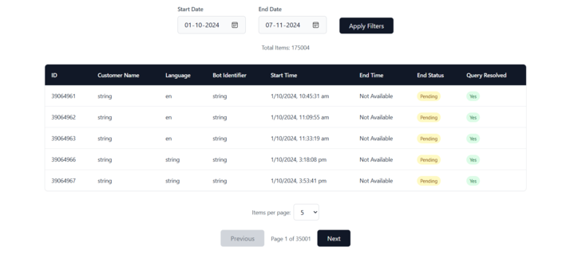

# Pagination Data Table

## Overview
This React component creates a dynamic, feature-rich paginated data table for displaying conversation data with advanced filtering and pagination capabilities.

## Features
### Data Management

- Server-side pagination
- Date range filtering
- Sorting capabilities
- Responsive design
- Loading and empty state handling

### Key Functionalities

- Filter conversations by date range
- Customize items per page (5-50)
- Sort by different columns
- Navigate through paginated results
- Display conversation details

## Screenshots

## Prerequisites

- React Js
- Tailwind CSS
